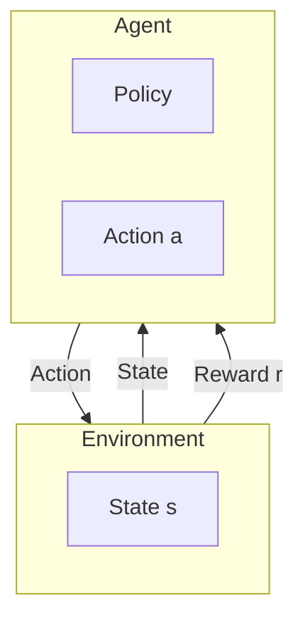

*Your comprehensive guide to understanding reinforcement learning and its revolutionary applications in 2026*

---

## Introduction

Remember when we learned about neural networks, transformers, and diffusion models? Today we're diving into another cornerstone of artificial intelligence: **Reinforcement Learning (RL)**. 

While supervised learning learns from labeled data and unsupervised learning finds patterns in unlabeled data, reinforcement learning is fundamentally different—it's about learning through interaction with an environment, through trial and error, guided by rewards and penalties.

Think about how a child learns to ride a bike. They try various actions, some lead to successful balance (rewards), others lead to falls (penalties). Over time, they develop an intuitive policy for what actions work best in different situations. This is exactly the paradigm RL mimics.

In 2026, RL has transitioned from theoretical research to real-world commercial applications, making it an essential topic for any AI practitioner.

---

## Core Concepts of Reinforcement Learning

### The RL Framework

At its heart, RL involves four main components:

1. **The Agent**: The AI system that learns and makes decisions
2. **The Environment**: The world the agent interacts with
3. **Actions**: The decisions the agent can make
4. **Rewards**: Feedback from the environment (positive or negative)



### Key Terminology

- **State (s)**: A snapshot of the environment at a given time
- **Action (a)**: What the agent can do in each state
- **Reward (r)**: Immediate feedback from taking an action
- **Return (G)**: Cumulative future rewards: G = r₀ + γr₁ + γ²r₂ + ...
- **Discount Factor (γ)**: Values immediate rewards more than future ones (0 < γ < 1)
- **Policy (π)**: The agent's strategy for choosing actions based on states
- **Value Function (V)**: Expected long-term reward from a state
- **Q-Function (Q)**: Expected reward from taking action in a state

---

## Popular RL Algorithms

### Q-Learning

The foundation of many RL algorithms. Q-Learning learns the value of state-action pairs:

```
Q(s, a) ← Q(s, a) + α [r + γ max Q(s', a') - Q(s, a)]
```

Where:
- α = learning rate
- γ = discount factor
- s' = next state

### Deep Q-Networks (DQN)

When the state space becomes too large, we use deep neural networks to approximate Q-values:

```python
import torch
import torch.nn as nn

class DQN(nn.Module):
    def __init__(self, input_dim, output_dim):
        super().__init__()
        self.network = nn.Sequential(
            nn.Linear(input_dim, 128),
            nn.ReLU(),
            nn.Linear(128, 128),
            nn.ReLU(),
            nn.Linear(128, output_dim)
        )
    
    def forward(self, x):
        return self.network(x)
```

DQN introduced two key innovations:
1. **Experience Replay**: Store transitions in a replay buffer and sample randomly
2. **Target Network**: Use a separate network for computing target values to stabilize training

### PPO (Proximal Policy Optimization)

One of the most popular modern algorithms, PPO optimizes policies while ensuring they don't change too drastically:

```python
# Simplified PPO loss
def ppo_loss(old_log_prob, new_log_prob, advantage, clip_epsilon=0.2):
    ratio = torch.exp(new_log_prob - old_log_prob)
    clipped = torch.clamp(ratio, 1 - clip_epsilon, 1 + clip_epsilon)
    return -torch.min(ratio * advantage, clipped * advantage).mean()
```

### GRPO (Generalized Reward Policy Optimization)

A newer algorithm gaining traction in 2026, particularly for training LLMs. GRPO removes the need for a separate value function, making training more efficient:

- Groups responses by question
- Computes rewards within groups
- Optimizes policy directly based on relative performance

---

## 2026: The Year RL Goes Mainstream

### From Theory to Production

2026 marks a pivotal year for reinforcement learning. The key trends:

#### 1. Enterprise RL Environments
Companies are building sophisticated "digital twins" of business operations—simulated environments where AI agents can learn and improve before deployment:

- Customer service optimization
- Revenue-maximizing strategies in live commerce
- Supply chain and logistics

#### 2. RL for Large Language Models
Reinforcement learning has become crucial for training better LLMs:

- **RLHF** (Reinforcement Learning from Human Feedback)
- **GRPO** and **RLVR** (Reinforcement Learning with Verifiable Rewards)
- Training reasoning models at scale

#### 3. Sample Efficiency Improvements
New algorithms are making RL training faster and more practical:

| Algorithm | Key Improvement |
|-----------|-----------------|
| Crossq | Faster convergence |
| MR. Q | Reduced sample complexity |
| XQC | Better exploration |

#### 4. Persistent Agents
Modern agents can:
- Handle longer, more complex workflows
- Integrate with local files and applications
- Maintain context across sessions
- Execute multi-step tasks autonomously

---

## Practical Applications

### 1. Robotics
RL enables robots to learn complex tasks like manipulation, locomotion, and navigation through trial and error.

### 2. Game Playing
From AlphaGo to competitive gaming, RL has achieved superhuman performance in complex strategy games.

### 3. Recommendation Systems
Learning optimal sequences of recommendations based on user engagement.

### 4. Autonomous Vehicles
Decision-making for navigation, obstacle avoidance, and traffic optimization.

### 5. LLM Training
Fine-tuning language models using RLHF and GRPO for better reasoning and instruction-following.

---

## Implementing Your First RL Agent

Let's build a simple DQN agent for the CartPole environment:

```python
import gymnasium as gym
import numpy as np
import torch
import torch.nn as nn
import torch.optim as optim
from collections import deque
import random

# Experience Replay Buffer
class ReplayBuffer:
    def __init__(self, capacity=10000):
        self.buffer = deque(maxlen=capacity)
    
    def push(self, state, action, reward, next_state, done):
        self.buffer.append((state, action, reward, next_state, done))
    
    def sample(self, batch_size):
        batch = random.sample(self.buffer, batch_size)
        states, actions, rewards, next_states, dones = zip(*batch)
        return (np.array(states), np.array(actions), 
                np.array(rewards), np.array(next_states), 
                np.array(dones))

# Deep Q-Network
class DQN(nn.Module):
    def __init__(self, state_dim, action_dim):
        super().__init__()
        self.net = nn.Sequential(
            nn.Linear(state_dim, 128),
            nn.ReLU(),
            nn.Linear(128, 128),
            nn.ReLU(),
            nn.Linear(128, action_dim)
        )
    
    def forward(self, x):
        return self.net(x)

# Training
def train_dqn(env_id='CartPole-v1', episodes=500, batch_size=64):
    env = gym.make(env_id)
    state_dim = env.observation_space.shape[0]
    action_dim = env.action_space.n
    
    q_network = DQN(state_dim, action_dim)
    target_network = DQN(state_dim, action_dim)
    target_network.load_state_dict(q_network.state_dict())
    
    optimizer = optim.Adam(q_network.parameters(), lr=0.001)
    replay_buffer = ReplayBuffer()
    
    epsilon = 1.0
    epsilon_decay = 0.995
    epsilon_min = 0.01
    target_update_freq = 10
    
    for episode in range(episodes):
        state, _ = env.reset()
        total_reward = 0
        
        while True:
            # Epsilon-greedy action selection
            if random.random() < epsilon:
                action = env.action_space.sample()
            else:
                with torch.no_grad():
                    action = q_network(torch.FloatTensor(state)).argmax().item()
            
            next_state, reward, terminated, truncated, _ = env.step(action)
            done = terminated or truncated
            
            replay_buffer.push(state, action, reward, next_state, done)
            state = next_state
            total_reward += reward
            
            # Training step
            if len(replay_buffer.buffer) >= batch_size:
                states, actions, rewards, next_states, dones = replay_buffer.sample(batch_size)
                
                states = torch.FloatTensor(states)
                actions = torch.LongTensor(actions)
                rewards = torch.FloatTensor(rewards)
                next_states = torch.FloatTensor(next_states)
                dones = torch.FloatTensor(dones)
                
                # Compute Q values
                q_values = q_network(states).gather(1, actions.unsqueeze(1)).squeeze()
                
                # Compute target
                with torch.no_grad():
                    max_q = target_network(next_states).max(1)[0]
                    targets = rewards + (1 - dones) * 0.99 * max_q
                
                # Update
                loss = nn.MSELoss()(q_values, targets)
                optimizer.zero_grad()
                loss.backward()
                optimizer.step()
            
            if done:
                break
        
        # Decay epsilon
        epsilon = max(epsilon_min, epsilon * epsilon_decay)
        
        # Update target network
        if episode % target_update_freq == 0:
            target_network.load_state_dict(q_network.state_dict())
        
        if episode % 50 == 0:
            print(f"Episode {episode}: Reward = {total_reward}, Epsilon = {epsilon:.3f}")
    
    env.close()

if __name__ == "__main__":
    train_dqn()
```

---

## Learning Resources for 2026

### Courses
- **Stanford CS234**: Reinforcement Learning (Winter 2026)
- **Coursera**: Deep Reinforcement Learning Specialization
- **Unsloth GRPO Guide**: Practical guide for training LLMs with RL

### Books
- "Reinforcement Learning: An Introduction" by Sutton & Barto (the classic)
- "Deep Reinforcement Learning Hands-On" by Maxim Lapan

### Practice Platforms
- OpenAI Gym / Gymnasium
- Unity ML-Agents
- DeepMind Lab
- StarCraft II Learning Environment

---

## What's Next?

Now that you understand RL fundamentals, here's a learning path:

1. **This week**: Run the DQN code above
2. **Next week**: Try PPO on continuous control tasks
3. **Month 2**: Explore multi-agent RL
4. **Month 3**: Learn RLHF for LLM fine-tuning

---

## Conclusion

Reinforcement learning represents a fundamentally different approach to AI—one where agents learn through interaction rather than from static datasets. In 2026, RL has come into its own, powering everything from LLM training to enterprise automation.

The key insight of RL—learning from feedback through trial and error—mirrors how we as humans learn most naturally. As RL algorithms become more efficient and practical, we're seeing AI systems that can truly "learn by doing."

Stay curious, keep experimenting, and see you next Friday for more deep learning content!

---

*Next in series: Computer Vision fundamentals (CNNs)*